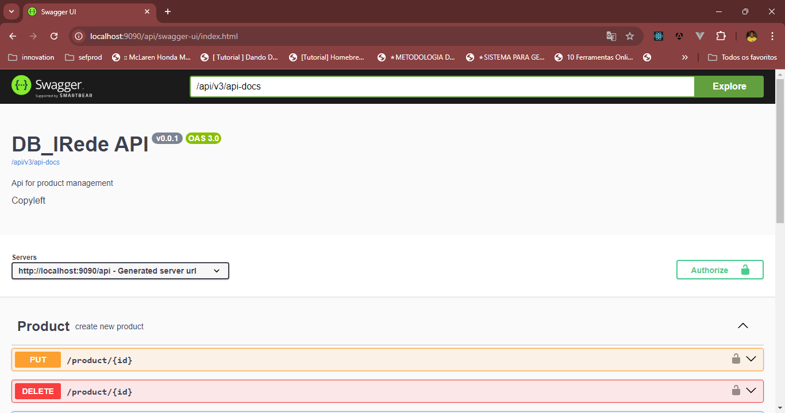
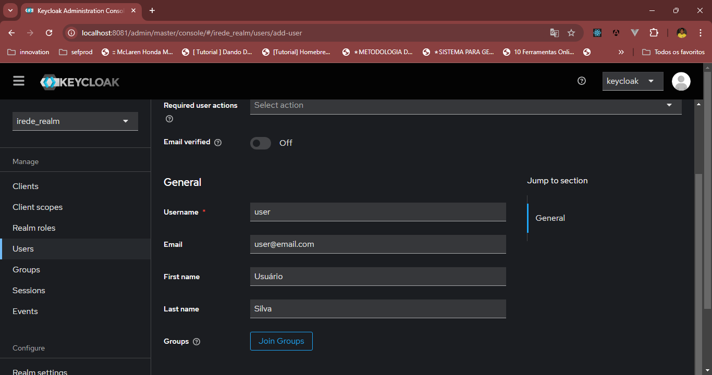
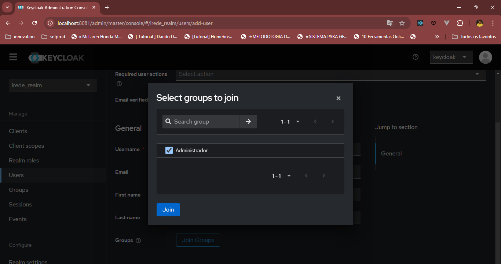
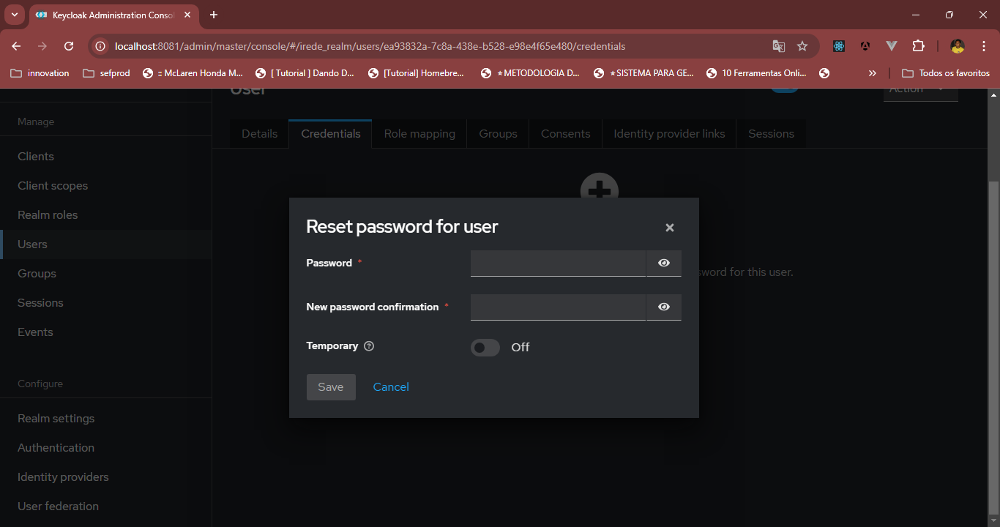
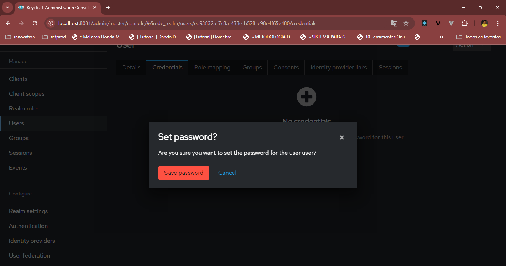

# DB_IRede

Implementação de um sistema back-end e integração
com o banco de dados que gerencia produtos

<!-- TOC -->
* [Rodando localmente](#rodando-localmente)
* [Rodando Docker](#rodando-docker)
* [Stack utilizada](#stack-utilizada)
* [Documentação da API](#documentação-da-api)
* [Keycloak](#keycloak)
<!-- TOC -->

## Rodando localmente 

Clone o projeto

```bash
  git clone https://github.com/manoel180/db_irede.git
```

Entre no diretório do projeto

```bash
  cd db_irede
```

Crie um arquivo .env na raiz do projeto e adicione as seguintes variáveis de ambiente

```bash
    KEYCLOAK_DB=keycloak_db
    MYSQL_USER=root
    MYSQL_PASSWORD=root
    MYSQL_ROOT_PASSWORD=root
    KEYCLOAK_ADMIN=keycloak
    KEYCLOAK_ADMIN_PASSWORD=keycloak
    DATABASE_HOST=localhost
    DATABASE_PORT=3306
    DATABASE_NAME=db_iredeDB
    DATABASE_USERNAME=root
    DATABASE_PASSWORD=root
    JWT_ISSUER_URI=http://keycloak:8080/realms/irede_realm
    KC_SECRET=0TYW19lIBDuUzXDSfDt9PmmOpzwBF88q
```

Inicie o servidor

```bash
  gradlew bootRun
```

## Rodando Docker

Entre no diretório do projeto

```bash
  cd db_irede
```
Suba o container

```bash
  docker-compose up -d
```


## Stack utilizada

**Devops:** Docker, Docker Compose
**Banco de dados:** MySQL
**Back-end:** Spring Boot, Java 21, Lombok, Swagger, Liquibase


## Documentação da API

Para acessar a documentação da API, acesse o link abaixo:

```http
  http://localhost:9090/api/swagger-ui/index.html
```


## Keycloak
 para acessar o keycloak, acesse o link abaixo:

```http
  http://localhost:8081/
```
O usuário e senha padrão são:

```http
  usuário: keycloak
  senha: keycloak
```

para cadastrar um novo usuário, acesse o link abaixo:
 
```http
  http://localhost:8081/auth/realms/irede/account
```

imagem cadastro do usuário do keycloak:

em grupos vincule o usuário ao grupo de admin no botao join groups

Quando o usuário for criado precisa ser criado uma senha temporária, para isso clique em "credentials" e depois em "update password"

Vai perguntar se tem certeza que deseja criar uma senha , clique em "save password"

Depois de criar a senha temporária, faça o login com o usuário e senha criados

